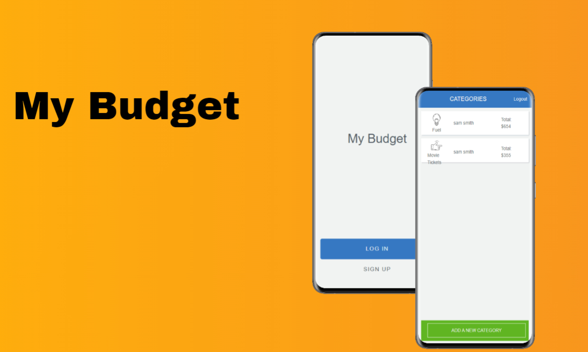

# Budgetly App

 

> A mobile web application where you can manage your budget 
> With a list of transactions associated with a category, so that you can see how much money you spent and on what.

## Demo photo: 




## Demo Link: 

[live Demo](https://my-budget123.herokuapp.com/) 


## Built With

- Ruby on Rails
- PostgreSQL

## Getting Started

To get a local copy up and running follow these simple example steps.

### Prerequisites

- [Ruby](https://www.ruby-lang.org/en/)
- [Rails](https://gorails.com/)

### Setup

- Make sure you have Ruby on Rails set up properly on your computer
- Clone or download this repo on your machine
- Enter project directory

### Install

```sh
bundle install
```

### Database

```sh
# Create user
sudo -u postgres createuser budgeapp -s

# Create the database
rails db:create

## Apply migration
rails db:migrate

# Load the schema
rails db:schema:load
```

### Run

```sh
rails s
```

### Test

```sh
rspec
```

## Author

👤 **Sumair Qaisar Jadoon**

- GitHub: [@sumairq](https://github.com/sumairq)
- Twitter: [@sumair_qaisar](https://twitter.com/sumair_qaisar)
- LinkedIn: [LinkedIn](https://linkedin.com/in/sumairq)

## 🤝 Contributing:

Contributions, issues, and feature requests are welcome!

Feel free to check the [issues page](https://github.com/sheylaPozo/budgetapp/issues).

## Show your support:

Give a `⭐️` if you like this project!

## Acknowledgments:

Hat tip to anyone whose code was used:
- Microverse's guidelines
- Original design idea by Gregoire Vella on [Behance](https://www.behance.net/gregoirevella).
- Inspiration

## 📝 License:

This project is [MIT](./LICENSE.md) licensed.
